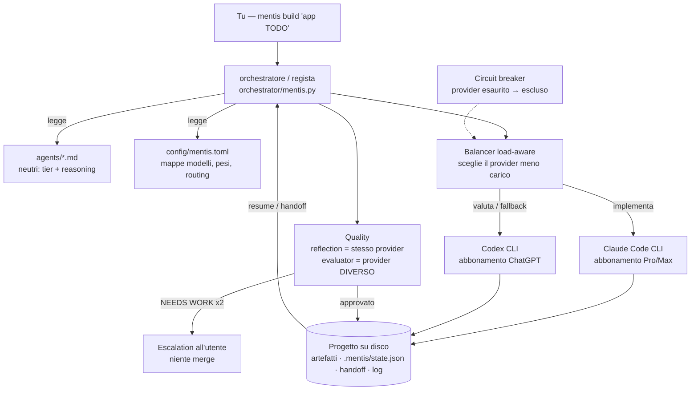
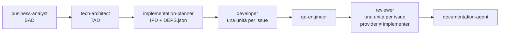

# mentis

**Orchestratore agentico agnostico rispetto al provider LLM — a subscription, non ad API.**
*A provider-agnostic multi-agent orchestrator that drives official subscription CLIs (Claude Code, OpenAI Codex) instead of paid APIs — for cross-model de-biasing, automatic fallback, and independent review.*

mentis prende uno stesso sistema di agenti (analista → architetto → planner → sviluppatore → QA → reviewer → docs) e lo esegue su **provider diversi** — oggi **Claude** (via Claude Code CLI) e **GPT-5.6** (via Codex CLI) — usando **gli abbonamenti che paghi**, non chiavi API a consumo. Serve per **sfidare** l'output di un modello con un altro, **switchare in automatico** quando un provider esaurisce i limiti, e ottenere una **review indipendente** su un modello diverso da quello che ha scritto il codice.

> Il regista sta **sopra** le CLI, non dentro: non ha tool propri né un cervello LLM. Sceglie *quale* CLI esegue *quale* passo, passa i compiti come prompt e le consegne come **file su disco**.

---

## Architettura



## La pipeline `build`



Ogni passo scrive il suo artefatto su disco; il passo dopo lo legge. È questo — e non uno stato in memoria — che rende la pipeline portabile tra provider: un file `.md` è neutro, non importa quale modello l'ha scritto.

---

## Cosa fa

| | Feature | In breve |
|---|---|---|
| 🔀 | **De-bias / challenge** | Stesso task su più provider, output affiancati per il confronto (`--compare`). |
| ↯ | **Fallback automatico** | Se un provider esaurisce i limiti, il task passa da solo al successivo. |
| 🛡️ | **Review anti-bias** | Il reviewer gira **sempre** su un provider diverso da chi ha implementato. |
| ⚖️ | **Balancer load-aware** | I ruoli ruotano così i due abbonamenti si consumano **insieme**, non uno solo. |
| 💾 | **Resumability** | Stato per-unità salvato dopo ogni unità: un run interrotto **riprende** da dove era. |
| ◇ | **Quality** | Reflection (auto-critica) + evaluator-optimizer cross-provider, loop cap 2 poi escalation. |
| 🧩 | **Fan-out per-issue** | `developer` e `reviewer` si espandono per issue, con ordinamento a dipendenze. |
| ⛓ | **Parallelismo** | Issue indipendenti su provider distinti in contemporanea (`--parallel`). |
| 🩺 | **doctor** | Aggiorna la mappa dei modelli quando esce una nuova famiglia — scoperta automatica, decisione tua. |
| 🧭 | **Osservabilità** | Ogni chiamata loggata; `mentis status` riassume carico, finestre, stato. |
| 📇 | **Contratto strutturato** | Ogni agente chiude con `[[MENTIS-RESULT]]{status,...}`: l'orchestratore consuma un'interfaccia, non prosa. |
| ⏸ | **HITL riprendibile** | `needs_input` mette in pausa e scrive le domande su file; rispondi in `.mentis/answers/` e rilancia per riprendere. |

Perché **a subscription e non ad API**: gli abbonamenti consumer (ChatGPT Plus, Claude Pro/Max) non danno accesso API — ma ogni vendor spedisce una **CLI agentica** che si autentica con l'abbonamento. mentis pilota quelle CLI in headless. I *tool* (leggere/scrivere file, eseguire comandi) li porta ogni CLI; l'orchestratore fa solo da regista.

---

## Uso

```bash
python3 orchestrator/mentis.py <comando> "<descrizione>" [flag]
```

Oppure installa il wrapper **`mentis`** e usalo come comando:

```bash
ln -s "$(pwd)/bin/mentis" /usr/local/bin/mentis   # una volta (o aggiungi bin/ al PATH)
mentis build "app TODO" --project ~/dev/todo
mentis status --project ~/dev/todo
```

| Comando | Cosa fa |
|---|---|
| `build "<descrizione>"` | Pipeline completa: BAD → TAD → IPD → developer → qa → reviewer → docs |
| `tad "<descrizione>"` | Solo l'architettura (tech-architect) |
| `bad "<descrizione>"` | Solo l'analisi (business-analyst) |
| `review "<PR/branch>"` | Solo review, su provider ≠ implementer |
| `mvp "<descrizione>"` | Sito statico (mvp-builder) |
| `doctor` | Manutenzione della mappa modelli |
| `status` | Carico per provider, finestre, stato unità, log |

**Flag principali:** `--project DIR` (default: cartella corrente) · `--compare` (challenge multi-provider) · `--quality off\|reflect\|evaluate\|full` · `--parallel` · `--fresh` (ignora lo stato) · `--dry-run`.

### Esempi

```bash
# pipeline completa su un progetto
python3 orchestrator/mentis.py build "app TODO con login" --project ~/dev/todo

# challenge: stesso TAD su Claude E GPT, output affiancati
python3 orchestrator/mentis.py tad "gateway pagamenti" --compare

# massimo controllo qualità + issue indipendenti in parallelo
python3 orchestrator/mentis.py build "app TODO" --quality full --parallel

# interrotto a metà? rilancia lo stesso comando: riprende dalle unità non fatte
python3 orchestrator/mentis.py build "app TODO" --project ~/dev/todo

# stato del progetto
python3 orchestrator/mentis.py status --project ~/dev/todo
```

---

## Stato attuale: DRY-RUN

> ⚠️ **Stato onesto.** La logica di mentis è coperta da una **suite di test** (`tests/`, stdlib `unittest` — esegui `python3 -m unittest discover -s tests`) e validata in dry-run. Ma mentis **non ha mai eseguito una chiamata reale** (nessun abbonamento attivo: entrambi i provider sono `enabled = false`): in dry-run stampa **il piano** senza eseguire nulla. Un review tecnico esterno ha fatto emergere bug di integrazione (crash sullo schema DEPS, timing del fan-out, verifica output, rate-limit): i **bloccanti sono corretti**, ed è stato aggiunto un **contratto di esito strutturato** (`done|needs_input|failed`) con **HITL riprendibile**. Il debito residuo — corpi degli agenti ancora Claude-oriented dietro un adapter di prosa — è tracciato in `DESIGN.md §13`.

### Attivare un provider

1. Installa e fai **login con l'abbonamento** alla CLI (non una API key): `claude` (Pro/Max) e/o `codex` (ChatGPT Plus/Pro).
2. In `config/mentis.toml` metti `enabled = true` sul provider.
3. **Verifica i flag** nella riga `cmd` con `claude --help` / `codex --help` (cambiano spesso) — è l'unica cosa da ritoccare.
4. Rilancia senza `--dry-run`.

---

## Come mappa gli agenti su modelli diversi

Gli agenti non nominano modelli: dichiarano un **tier** (quanto forte) e un **reasoning** (quanto ragiona). L'orchestratore li traduce per il provider corrente — tabelle in `config/mentis.toml`:

| L'agente dice | Claude | GPT-5.6 |
|---|---|---|
| `tier: frontier` | opus-4-8 | gpt-5.6-sol |
| `tier: balanced` | sonnet | gpt-5.6-terra |
| `tier: fast` | haiku-4-5 | gpt-5.6-luna |
| `reasoning: high` | thinking ~10k token | reasoning effort `high` |

Quando esce una nuova famiglia (es. `gpt-5.7-*`) cambi solo 3 righe — o lo fa `doctor`:

```bash
python3 orchestrator/mentis.py doctor --provider codex \
    --models "gpt-5.7-sol,gpt-5.7-terra,gpt-5.7-luna" --apply
```

---

## Design pattern — cosa, come, perché

mentis non inventa un'architettura da zero: **compone pattern agentici ormai standard** (Anthropic "Building effective agents", la letteratura orchestrator-worker del 2026) su una spina dorsale semplice, più **un pattern originale** — la review anti-bias cross-provider — che è la ragione d'essere del progetto. Ogni scelta ha un costo: sotto, il *perché* accanto al *come*. Il razionale esteso è in **[DESIGN.md](DESIGN.md)**.

> **Se leggi una cosa sola:** ciò che rende mentis *mentis* sono tre scelte — l'**handoff su disco** (rende la pipeline portabile tra provider), la **review anti-bias cross-provider** (un secondo parere davvero indipendente) e il **balancing con rotazione dei ruoli** (i due abbonamenti si esauriscono insieme). Tutto il resto sono pattern standard che mentis compone per reggere l'esecuzione headless multi-provider.

### La spina dorsale

| Pattern | Come lo usa mentis | Perché |
|---|---|---|
| **Orchestrator-Worker** | Il regista (`mentis.py`) sta *sopra* le CLI: nessun cervello LLM, nessun tool proprio. Sceglie quale CLI esegue quale passo. Lo spawn di sotto-agenti — che in Claude Code era *dentro* l'agente — qui **sale nell'orchestratore** (il `for` sugli step). | Un regista deterministico rende il flusso ispezionabile e riproducibile; la parte "intelligente" resta isolata nelle CLI, sostituibili. (§2) |
| **Sequential Pipeline / Prompt Chaining** | BAD → TAD → IPD → developer → qa → reviewer → docs. Ogni passo consuma l'artefatto del precedente. | Task complesso spezzato in sottotask verificabili uno alla volta; ogni handoff è un punto di controllo. |
| **Externalized state (handoff su disco)** | Il passaggio tra agenti è **file su disco** (`business-analysis/`, `tech-analysis/`, …), non stato in memoria. Ogni agente scrive anche una **nota di handoff** (`fatto / da fare / decisioni`). | Un `.md` è **neutro**: non importa quale modello l'ha scritto. È *questo* che rende la pipeline portabile tra provider — il contesto durevole vive sul disco condiviso, non nella sessione della CLI. (§10) |
| **Config-driven Strategy (tier + reasoning)** | L'agente dichiara `tier` (quale modello) e `reasoning` (quanto ragiona), due assi ortogonali; le tabelle in `mentis.toml` li traducono nel modello reale del provider corrente, con **clamping** al gradino più vicino se manca. | Aggiungere un provider = una sezione + una colonna, **zero modifiche agli agenti**. Il costo di manutenzione dei nomi-modello è ridotto a una tabella (`doctor` la aggiorna). (§3–4, §8) |

### I pattern di affidabilità

| Pattern | Come lo usa mentis | Perché |
|---|---|---|
| **Layered Fallback** | Su rate-limit (rc≠0 **E** pattern su stderr) lo stesso prompt passa al provider successivo in `preference`. | È lo switch "quando un abbonamento si esaurisce" — il requisito originale del progetto. (§5) |
| **Circuit Breaker** | Un provider rate-limited resta **escluso per il resto del run**, con budget di retry globale + backoff sugli errori transitori. | Evita di martellare un provider già al muro (accelererebbe solo il blocco) e di sprecare il budget di retry. (§9) |
| **Durable Execution / Checkpointing** | `.mentis/state.json` per-unità (`pending/running/done` + hash input + artefatto), scritto **dopo ogni unità**. Al rilancio salta il `done` valido e riprende dalla prima unità non fatta; `--fresh` resetta. | Il rate-limit è una **porta binaria** (429), non un segnale che scema: niente "ultimo respiro" per salvare lo stato. Quindi si salva *in continuo*, così è già su disco *prima* che la porta sbatta. Un crash/switch perde al più il ragionamento di *una* unità. (§10) |
| **Human-in-the-Loop riprendibile** | `needs_input` → le domande vanno in `.mentis/questions/`, l'unità va in `awaiting_input`, la pipeline si ferma; rispondi in `.mentis/answers/` e al rilancio riprende con le risposte iniettate. | `AskUserQuestion` è incompatibile con l'esecuzione headless: l'HITL diventa un **handshake su file**, riprendibile a distanza di tempo. (§13) |

### I pattern di qualità

| Pattern | Come lo usa mentis | Perché |
|---|---|---|
| **Reflection** | Auto-critica dello **stesso** provider prima della consegna (`--quality reflect`). | Filtro economico per errori oggettivi — ma **vale davvero solo con un segnale esterno** (test, build): forte su developer/qa, debole su prosa. Per questo il default è pesato sul rischio, non `full` piatto. (§9) |
| **Evaluator-Optimizer** | Un provider **diverso** valuta con una **rubrica per tipo di agente**; se boccia, l'implementer revisiona. Loop **cap = 2**, poi **stop + escalation all'utente** (niente merge). | Un ciclo genera→valuta→revisiona alza la qualità senza loop infiniti; il cap trasforma il disaccordo persistente in una decisione umana invece che in un ping-pong. (§9) |
| **Structured Output Contract** | Ogni agente chiude con `[[MENTIS-RESULT]]{status,artifacts,questions,note}`; `parse_result` lo consuma. | La diagnosi-radice del review esterno era *"il contratto era prosa, non un'interfaccia"*. Ora l'orchestratore consuma un'**interfaccia tipizzata**, non testo da interpretare. (§13) |

### Il pattern originale — perché mentis esiste

| Pattern | Come lo usa mentis | Perché |
|---|---|---|
| **Review anti-bias cross-provider** | Il reviewer **non gira mai** sul provider che ha scritto il codice. L'orchestratore legge l'implementer da `state.json` e instrada il reviewer sull'**altro**; doppia sicurezza nel prompt del reviewer che rifiuta se coincidono. Con un solo provider attivo → degrada e **scala all'utente**, non auto-approva. | Un modello che rivede sé stesso condivide i propri **punti ciechi**: l'intero senso della review è un secondo parere *indipendente*. È la generalizzazione dell'evaluator, ed è il motivo per cui mentis è multi-provider e non multi-modello-dello-stesso-vendor. (§7) |
| **Load-aware balancing + role rotation** | Contatore di lavoro pesato per provider (implement 1.0 / evaluate 0.3 …): implementa il **meno carico**, valuta il **più scarico tra gli altri**. Reset **a finestra** (le quote si sbloccano a scatti ogni N ore), non a decadimento. | Con ruoli fissi un provider si svuota ~3× più in fretta e arrivi al muro con l'altro quasi libero: throughput sprecato. La rotazione fa esaurire i **due budget insieme** → massimo numero di artefatti prima di uno stop. (§11) |
| **Worktree isolation (parallelismo)** | In `--parallel` ogni unità implementante gira in un git worktree isolato (branch `mentis/{unit}`), issue indipendenti su **provider distinti** in contemporanea. | Issue senza dipendenze non devono aspettarsi a vicenda né collidere su `.git/index.lock`; girarle su provider diversi non accelera nessun rate-limit. (§11–12) |

> **Nota onesta.** Questi pattern sono implementati e coperti da test in dry-run, ma mentis **non ha ancora eseguito una chiamata reale**: la calibrazione fine (ore-finestra del balancer, flag esatti delle CLI) arriverà col primo run con abbonamenti attivi.

---

## Struttura

```
mentis/
├── agents/            # i 9 agenti, frontmatter NEUTRO (tier + reasoning)
├── config/
│   └── mentis.toml    # unico punto provider-specifico: mappe, pesi, routing, template CLI
├── orchestrator/
│   └── mentis.py      # il regista — stdlib pura, zero dipendenze (Python ≥ 3.7)
├── bin/
│   └── mentis         # wrapper CLI (mentis build ... invece di python3 orchestrator/mentis.py)
├── tests/
│   └── test_mentis.py # suite stdlib unittest — python3 -m unittest discover -s tests
├── README.md          # questo file
└── DESIGN.md          # architettura, decisioni e razionale in dettaglio
```

**Provider (config-driven):** Claude (Claude Code CLI) e GPT-5.6 (Codex CLI), entrambi
`enabled = false` finché non fai il login. Aggiungerne un altro = una sezione `[providers.X]`
+ una colonna nelle mappe di `mentis.toml`.

Zero dipendenze: `mentis.py` usa solo la standard library (incluso un mini-parser TOML). Nessun `pip install`.

Per il **perché** di ogni scelta — abbonamento vs API, i due tipi di contesto (durevole vs effimero), il reset a finestra del balancer, l'evaluator-optimizer — vedi **[DESIGN.md](DESIGN.md)**.

---

*mentis nasce come evoluzione provider-agnostica di un sistema di agenti costruito per Claude Code. Gli agenti restano neutri; l'orchestrazione, il de-bias e il bilanciamento vivono nel regista.*
